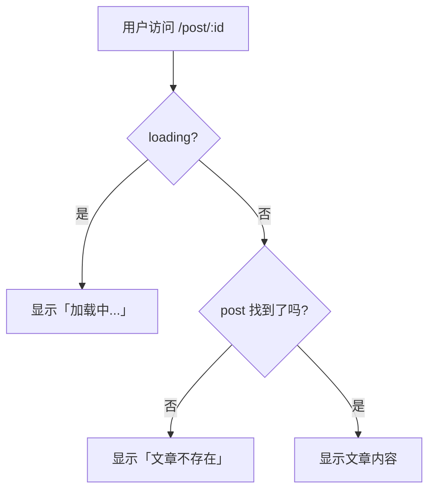

# 15 - 文章详情页

- 对应文档版本：N/A（教程系列第15篇）
- 适用环境：Vue 3 + Vite + Vue Router 4 / Node.js 18+
- 读者角色：前端开发者
- 预计耗时：新手 30分钟 / 熟手 10分钟
- 前置教程：[14 - 文章列表页](./14-文章列表页.md)
- 可视化：无

---

## 一、目标与完成效果

**一句话目标**：点击首页文章卡片后，跳转到详情页，根据路由参数 `id` 找到对应文章并显示完整内容，同时处理「文章不存在」的情况。

**完成后的可观测效果**：
- 首页点击任意文章卡片 → 跳转到 `/post/1`（或对应ID）
- 详情页显示该文章的标题、作者、日期、正文
- 详情页底部有「返回首页」链接
- 访问 `/post/999`（不存在的ID）→ 显示「文章不存在」提示

---

## 二、前置条件

| 前置项 | 版本/要求 | 验证命令 |
|--------|-----------|----------|
| 路由系统已配置 | 动态路由 `/post/:id` 可用 | 浏览器访问 `/post/1` 不报404 |
| Mock 数据已创建 | `src/mock/posts.js` 存在 | `ls src/mock/posts.js` |
| 首页文章列表可点击 | `BlogCard` 的 `router-link` 正常 | 点击卡片能跳转 |

---

## 三、分步操作

### 步骤1：用 useRoute 获取路由参数

#### 我在做什么？

详情页的核心逻辑就一句话：**从 URL 里拿到文章ID，然后从数据里找到对应文章**。

这就像你去图书馆，报一个书号，管理员从数据库里找到那本书递给你。URL 里的 `:id` 就是书号，`useRoute()` 是你报书号的方式，`posts.find()` 是管理员查书的过程。

**修改 `src/views/PostDetail.vue`**：

```vue
<template>
  <div class="post-detail">
    <!-- 加载中 -->
    <div v-if="loading">⏳ 加载中...</div>

    <!-- 文章不存在 -->
    <div v-else-if="!post" class="not-found">
      <h2>😕 文章不存在</h2>
      <p>你访问的文章ID「{{ id }}」可能已被删除，或从未存在。</p>
      <router-link to="/">← 返回首页</router-link>
    </div>

    <!-- 正常显示文章 -->
    <article v-else>
      <h1>{{ post.title }}</h1>
      <div class="meta">
        <span>👤 {{ post.author }}</span>
        <span>📅 {{ post.createdAt }}</span>
      </div>
      <hr />
      <div class="content">{{ post.content }}</div>
    </article>

    <!-- 返回首页链接（始终显示） -->
    <router-link to="/" class="back-link">← 返回首页</router-link>
  </div>
</template>

<script setup>
import { ref, onMounted } from 'vue'
import { useRoute } from 'vue-router'
import { posts } from '../mock/posts.js'

const route = useRoute()           // 获取当前路由信息
const id = Number(route.params.id) // 从路径参数中取出 id，并转为数字
const post = ref(null)             // 当前文章数据
const loading = ref(true)          // 加载状态

// 模拟从数据库查找文章
onMounted(() => {
  // 延迟 300ms 模拟网络请求（让你看到「加载中」效果）
  setTimeout(() => {
    const found = posts.find(p => p.id === id)
    post.value = found || null   // 找到了就赋值，找不到就是 null
    loading.value = false
  }, 300)
})
</script>

<style scoped>
.post-detail {
  max-width: 720px;
  margin: 0 auto;
  padding: 20px;
}
h1 {
  font-size: 28px;
  margin-bottom: 12px;
}
.meta {
  color: #999;
  font-size: 14px;
  display: flex;
  gap: 16px;
  margin-bottom: 16px;
}
.content {
  line-height: 1.8;
  font-size: 16px;
  margin-top: 16px;
}
.back-link {
  display: inline-block;
  margin-top: 30px;
  color: #42b983;
  text-decoration: none;
}
.not-found {
  text-align: center;
  padding: 60px 0;
}
.not-found h2 {
  font-size: 24px;
  margin-bottom: 12px;
}
.not-found p {
  color: #666;
  margin-bottom: 20px;
}
</style>
```

#### 代码逐行解释

| 代码 | 含义 |
|------|------|
| `useRoute()` | 获取当前路由的信息对象，包含 `params`、`path`、`query` 等 |
| `route.params.id` | 从 URL `/post/42` 中取出 `"42"`（注意：这是**字符串**） |
| `Number(route.params.id)` | 把字符串 `"42"` 转为数字 `42`，因为 mock 数据里的 `id` 是数字 |
| `posts.find(p => p.id === id)` | 数组查找方法，找到第一个 `id` 匹配的文章，找不到返回 `undefined` |
| `v-if="loading"` | 加载中状态 |
| `v-else-if="!post"` | 文章不存在（`find` 返回 `undefined`，转布尔值为 `false`） |
| `v-else` | 正常显示文章 |

#### 我做得对不对？

- [ ] 浏览器访问 `/post/1`，显示「Vue 3 入门指南」文章？
- [ ] 浏览器访问 `/post/7`，显示「前端性能优化」文章？
- [ ] 浏览器访问 `/post/999`，显示「文章不存在」？
- [ ] 每个页面底部都有「返回首页」链接？

---

### 步骤2：理解三种状态的分支逻辑

#### 我在做什么？

详情页有**三种状态**，用 `v-if / v-else-if / v-else` 来处理。这就像自动门：有人靠近就开（文章存在），没人就关着（加载中），有人靠近但门坏了（文章不存在）。



| 状态 | 条件 | 用户看到什么 |
|------|------|-------------|
| 加载中 | `loading === true` | ⏳ 加载中... |
| 文章不存在 | `loading === false && post === null` | 😕 文章不存在 |
| 正常显示 | `loading === false && post !== null` | 文章标题+作者+正文 |

❌ **错误写法**：只判断 `v-if="post"` / `v-else`
- 问题：页面刚打开时 `post` 还是 `null`（数据还没加载完），会先闪现「文章不存在」，然后才显示文章。

✅ **正确写法**：三态判断 `v-if="loading"` / `v-else-if="!post"` / `v-else`
- 加载中 → 显示加载动画
- 加载完但没有数据 → 显示404
- 加载完且有数据 → 显示文章

🤔 **想多一点**：为什么 `Number(route.params.id)` 这一步很重要？因为 `route.params.id` 永远是字符串。`posts.find(p => p.id === "42")` 用 `===` 比较时，字符串 `"42"` 不等于数字 `42`，会返回 `undefined`——明明有这篇文章，却显示「文章不存在」。这就是 JavaScript 中 `===` 严格比较的陷阱。

---

### 步骤3：处理边界情况——文章不存在

#### 我在做什么？

用户可能通过以下方式访问不存在的文章：
- 手动输入 `/post/999`
- 从搜索引擎点进一个已删除的文章链接
- 书签里保存了被删除的文章

好的用户体验不是崩溃或白屏，而是给出友好的提示。

**404 处理的核心代码**（已在上面完整代码中）：

```vue
<div v-else-if="!post" class="not-found">
  <h2>😕 文章不存在</h2>
  <p>你访问的文章ID「{{ id }}」可能已被删除，或从未存在。</p>
  <router-link to="/">← 返回首页</router-link>
</div>
```

#### 设计要点

1. **告诉用户发生了什么**：不是冷冰冰的「404」，而是「文章不存在」
2. **告诉用户可能的原因**：「可能已被删除，或从未存在」
3. **给用户出路**：提供「返回首页」链接，别让用户困在死胡同里

---

### 步骤4：验证

```bash
npm run dev
```

#### 验证 Checklist

| 测试场景 | URL | 预期结果 |
|----------|-----|----------|
| 正常文章 | `/post/1` | 显示「Vue 3 入门指南」文章 |
| 正常文章 | `/post/5` | 显示「用 Pinia 管理 Vue 全局状态」 |
| 不存在 | `/post/999` | 显示「😕 文章不存在」+ 返回首页链接 |
| 不存在 | `/post/abc` | 显示「😕 文章不存在」(`Number("abc")` = `NaN`，`NaN === id` 永远 false) |
| 返回首页 | 点击底部链接 | 跳转到 `/` |

---

## 四、完整代码清单

<details>
<summary>src/views/PostDetail.vue（最终版）</summary>

```vue
<template>
  <div class="post-detail">
    <div v-if="loading">⏳ 加载中...</div>

    <div v-else-if="!post" class="not-found">
      <h2>😕 文章不存在</h2>
      <p>你访问的文章ID「{{ id }}」可能已被删除，或从未存在。</p>
      <router-link to="/">← 返回首页</router-link>
    </div>

    <article v-else>
      <h1>{{ post.title }}</h1>
      <div class="meta">
        <span>👤 {{ post.author }}</span>
        <span>📅 {{ post.createdAt }}</span>
      </div>
      <hr />
      <div class="content">{{ post.content }}</div>
    </article>

    <router-link to="/" class="back-link">← 返回首页</router-link>
  </div>
</template>

<script setup>
import { ref, onMounted } from 'vue'
import { useRoute } from 'vue-router'
import { posts } from '../mock/posts.js'

const route = useRoute()
const id = Number(route.params.id)
const post = ref(null)
const loading = ref(true)

onMounted(() => {
  setTimeout(() => {
    const found = posts.find(p => p.id === id)
    post.value = found || null
    loading.value = false
  }, 300)
})
</script>

<style scoped>
.post-detail {
  max-width: 720px;
  margin: 0 auto;
  padding: 20px;
}
h1 {
  font-size: 28px;
  margin-bottom: 12px;
}
.meta {
  color: #999;
  font-size: 14px;
  display: flex;
  gap: 16px;
  margin-bottom: 16px;
}
.content {
  line-height: 1.8;
  font-size: 16px;
  margin-top: 16px;
}
.back-link {
  display: inline-block;
  margin-top: 30px;
  color: #42b983;
  text-decoration: none;
}
.not-found {
  text-align: center;
  padding: 60px 0;
}
.not-found h2 {
  font-size: 24px;
  margin-bottom: 12px;
}
.not-found p {
  color: #666;
  margin-bottom: 20px;
}
</style>
```
</details>

---

## 五、小结

| 我学了什么 | 关键点 |
|------------|--------|
| 获取路由参数 | `useRoute().params.id` |
| 类型转换陷阱 | `route.params.id` 是字符串，需要 `Number()` 转数字 |
| 数组查找 | `posts.find(p => p.id === id)` |
| 三态判断 | `v-if` 加载中 / `v-else-if` 不存在 / `v-else` 正常 |
| 404 处理 | 文章不存在时给友好提示 + 返回首页链接 |
| 防闪烁 | 用 `loading` 状态避免「文章不存在」提前闪现 |

---

## 六、下一步建议

下一篇：[16 - 调用后端API](./16-调用后端API.md)，告别 mock 数据，用 `fetch` 从真正的后端 API 获取文章数据！

---

## 七、已知坑点与禁止事项

- ⚠️ **`route.params.id` 是字符串，不是数字**：用 `===` 比较时会和数字 `id` 失配，必须 `Number()` 转换。
- ⚠️ **`Array.find()` 找不到返回 `undefined`，不是 `null`**：`v-if="!post"` 对 `undefined` 和 `null` 都有效，但如果你用 `post === null` 判断会漏掉 `undefined`。